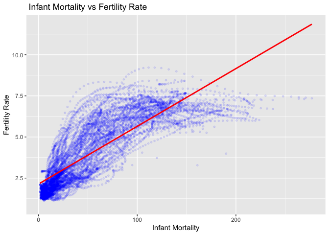

Data Visualization
================
Antoinette Gambaro
(17 June, 2022)

-   [Data `gapminder` from `dslabs`](#data-gapminder-from-dslabs)
    -   [Description of the data set
        `gapminder`](#description-of-the-data-set-gapminder)
    -   [Description of the variables](#description-of-the-variables)
    -   [LONG FORMAT](#long-format)
    -   [UNION](#union)
    -   [SEPARATION](#separation)
    -   [PLOT](#plot)
    -   [References](#references)

# Data `gapminder` from `dslabs`

This data set reports health and income outcomes of 184 countries from
1960 to 2016.

``` r
library(tidyverse)
library(knitr)
library(dslabs)
data("gapminder")
```

## Description of the data set `gapminder`

-   Country
-   Year
-   Infant_mortality (deaths per 1000)
-   Life_expectancy (in years)
-   Fertility. (Average no of children per woman)
-   Population
-   Gpd
-   Continent
-   Region

``` r
str(gapminder)
```

    ## 'data.frame':    10545 obs. of  9 variables:
    ##  $ country         : Factor w/ 185 levels "Albania","Algeria",..: 1 2 3 4 5 6 7 8 9 10 ...
    ##  $ year            : int  1960 1960 1960 1960 1960 1960 1960 1960 1960 1960 ...
    ##  $ infant_mortality: num  115.4 148.2 208 NA 59.9 ...
    ##  $ life_expectancy : num  62.9 47.5 36 63 65.4 ...
    ##  $ fertility       : num  6.19 7.65 7.32 4.43 3.11 4.55 4.82 3.45 2.7 5.57 ...
    ##  $ population      : num  1636054 11124892 5270844 54681 20619075 ...
    ##  $ gdp             : num  NA 1.38e+10 NA NA 1.08e+11 ...
    ##  $ continent       : Factor w/ 5 levels "Africa","Americas",..: 4 1 1 2 2 3 2 5 4 3 ...
    ##  $ region          : Factor w/ 22 levels "Australia and New Zealand",..: 19 11 10 2 15 21 2 1 22 21 ...

## Description of the variables

The data frame contain *10545 observation* of *9 variables*

-   **factors**: Country, Continent, Region
-   **numeric**: Infant_mortality, life_expectancy , Fertility,
    Population, Gpd.
-   **integer**; Year

## LONG FORMAT

Data set trasformed into a *long format*

``` r
gapminder_long <- gapminder %>% 
  pivot_longer(c("infant_mortality", "life_expectancy", "fertility", "population", "gdp"), names_to = "variable")
gapminder_long %>% head() %>% kable()
```

| country | year | continent | region          | variable         |      value |
|:--------|-----:|:----------|:----------------|:-----------------|-----------:|
| Albania | 1960 | Europe    | Southern Europe | infant_mortality |     115.40 |
| Albania | 1960 | Europe    | Southern Europe | life_expectancy  |      62.87 |
| Albania | 1960 | Europe    | Southern Europe | fertility        |       6.19 |
| Albania | 1960 | Europe    | Southern Europe | population       | 1636054.00 |
| Albania | 1960 | Europe    | Southern Europe | gdp              |         NA |
| Algeria | 1960 | Africa    | Northern Africa | infant_mortality |     148.20 |

## UNION

Union of *content* and *region*

``` r
gapminder_long <- gapminder_long %>% 
  unite(cont_region, continent, region)
gapminder_long %>% head() %>% kable()
```

| country | year | cont_region            | variable         |      value |
|:--------|-----:|:-----------------------|:-----------------|-----------:|
| Albania | 1960 | Europe_Southern Europe | infant_mortality |     115.40 |
| Albania | 1960 | Europe_Southern Europe | life_expectancy  |      62.87 |
| Albania | 1960 | Europe_Southern Europe | fertility        |       6.19 |
| Albania | 1960 | Europe_Southern Europe | population       | 1636054.00 |
| Albania | 1960 | Europe_Southern Europe | gdp              |         NA |
| Algeria | 1960 | Africa_Northern Africa | infant_mortality |     148.20 |

## SEPARATION

Separating *content* and *region*

``` r
gapminder_long <- gapminder_long %>% 
  separate(cont_region, into=c("continent", "region"), sep="_")
gapminder_long %>% head() %>% kable()
```

| country | year | continent | region          | variable         |      value |
|:--------|-----:|:----------|:----------------|:-----------------|-----------:|
| Albania | 1960 | Europe    | Southern Europe | infant_mortality |     115.40 |
| Albania | 1960 | Europe    | Southern Europe | life_expectancy  |      62.87 |
| Albania | 1960 | Europe    | Southern Europe | fertility        |       6.19 |
| Albania | 1960 | Europe    | Southern Europe | population       | 1636054.00 |
| Albania | 1960 | Europe    | Southern Europe | gdp              |         NA |
| Algeria | 1960 | Africa    | Northern Africa | infant_mortality |     148.20 |

## PLOT

Infant *mortality* vs *fertility*

``` r
library(ggplot2)
ggplot(gapminder, aes(infant_mortality, fertility)) +
  geom_point(alpha= 1/10, color= "blue", size= 1, na.rm= TRUE) +
  xlab(label = "Infant Mortality")+
  ylab(label= "Fertility Rate") +
  ggtitle(label= " Infant Mortality vs Fertility Rate") +
  geom_smooth(method= "lm", se= FALSE, color=" red")
```

    ## `geom_smooth()` using formula 'y ~ x'

<!-- -->

From the Plot we can see that there could be a positive correlation
between *Infant Mortality* and *Fertility Rate*

So, let’s check whether there is this correlation!

``` r
res <-cor.test(gapminder$infant_mortality, gapminder$fertility, method= "pearson")
res$estimate
```

    ##       cor 
    ## 0.8259883

## References

Irizarry, Rafael A., and Amy Gill. 2021. Dslabs: Data Science Labs.
<https://CRAN.R-project.org/package=dslabs>.
