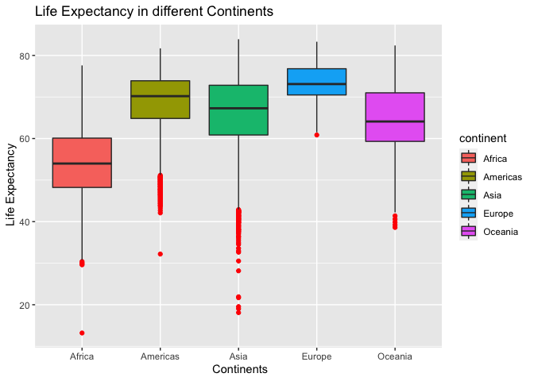

Data Visualization
================
Antoinette Gambaro
(19 June, 2022)

-   [Data `gapminder` from `dslabs`:](#data-gapminder-from-dslabs)
    -   [Description of the data set
        `gapminder`](#description-of-the-data-set-gapminder)
    -   [Description of the variables](#description-of-the-variables)
    -   [First question](#first-question)
    -   [Second question](#second-question)
    -   [Reference :](#reference-)

# Data `gapminder` from `dslabs`:

This data set reports health and income outcomes of 184 countries from
1960 to 2016.

``` r
install.packages('dslab', repos = "http://cran.us.r-project.org")
library(dslabs)
library(ggplot2)
library(tidyverse)
library(knitr)
library(magrittr)
library(dplyr)
install.packages('ggthemes', repos = "http://cran.us.r-project.org")
```

    ## 
    ## The downloaded binary packages are in
    ##  /var/folders/2t/3xt5b1gs5xqdffpypf0frtdc0000gn/T//RtmpJVP6BA/downloaded_packages

``` r
library(ggthemes)
library(ggrepel)
data("gapminder")
```

## Description of the data set `gapminder`

-   Country
-   Year
-   Infant_mortality (deaths per 1000)
-   Life_expectancy (in years)
-   Fertility. (Average no of children per woman)
-   Population
-   Gpd
-   Continent
-   Region

``` r
head(kable(gapminder))
```

    ## [1] "|country                        | year| infant_mortality| life_expectancy| fertility| population|          gdp|continent |region                    |"
    ## [2] "|:------------------------------|----:|----------------:|---------------:|---------:|----------:|------------:|:---------|:-------------------------|"
    ## [3] "|Albania                        | 1960|        115.40000|           62.87|      6.19|    1636054|           NA|Europe    |Southern Europe           |"
    ## [4] "|Algeria                        | 1960|        148.20000|           47.50|      7.65|   11124892| 1.382815e+10|Africa    |Northern Africa           |"
    ## [5] "|Angola                         | 1960|        208.00000|           35.98|      7.32|    5270844|           NA|Africa    |Middle Africa             |"
    ## [6] "|Antigua and Barbuda            | 1960|               NA|           62.97|      4.43|      54681|           NA|Americas  |Caribbean                 |"

## Description of the variables

the data frame contain *10545 observation* of *9 variables*

-   **factors**: Country, Continent, Region
-   **numeric**: Infant_mortality, life_expectancy , Fertility,
    Population, Gpd.
-   **integer**; Year

## First question

*Which is the continent that has the lowest life expectancy?*

First of all, I want to visualize the data to see the level of life
expectancy in the different continents

``` r
ggplot(gapminder, aes(continent,life_expectancy, fill=continent)) +
  geom_boxplot(outlier.colour="red") +
  xlab(label=" Continents") +
  ylab(label=" Life Expectancy") +
  ggtitle(label= "Life Expectancy in different Continents")
```

<!-- -->

We can see from the box plot that the continent with the lowest life
expectancy is *Africa*, whereas the rest of the continent show similar
level, however Europe is slightly higher compared *America*, *Asia* and
*Oceania*.

## Second question

*Is there a relationship between the the distribution of fertility and
infant mortality in Africa?*

Since *Africa* has the lowest level of life expectancy, I want to deep
in and see the distribution infant mortality (which could be have an
impact on the rate of life expectancy) in the different *region of
Africa*

``` r
Africa <- subset(gapminder,continent == "Africa")
ggplot(Africa, aes(infant_mortality, fill=region)) +

  geom_histogram(position = "identity")+
  stat_bin(bins = 30) +
   xlab(label= "Infant Mortality" ) +
  ylab(label="Frequency") +
  ggtitle(label= "Infant Mortality distribution in different regions of Africa")
```

    ## `stat_bin()` using `bins = 30`. Pick better value with `binwidth`.

    ## Warning: Removed 226 rows containing non-finite values (stat_bin).
    ## Removed 226 rows containing non-finite values (stat_bin).

<!-- -->

From the histogram we can see that the infant mortality is high
especially in Eastern Africa, maybe this region could be a great
contributor to the fact that Africa shows a lower life expectancy
compared to the other continent.

## Reference :

Irizarry, Rafael A., and Amy Gill. 2021. Dslabs: Data Science Labs.
<https://CRAN.R-project.org/package=dslabs>.
