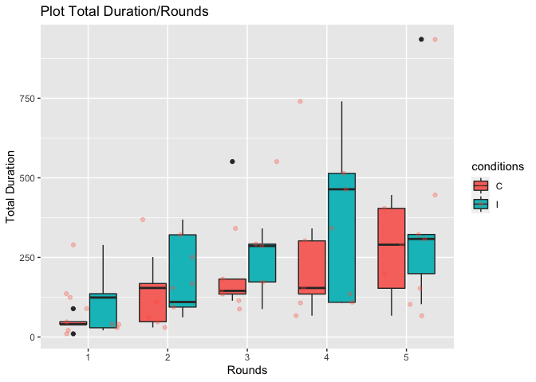
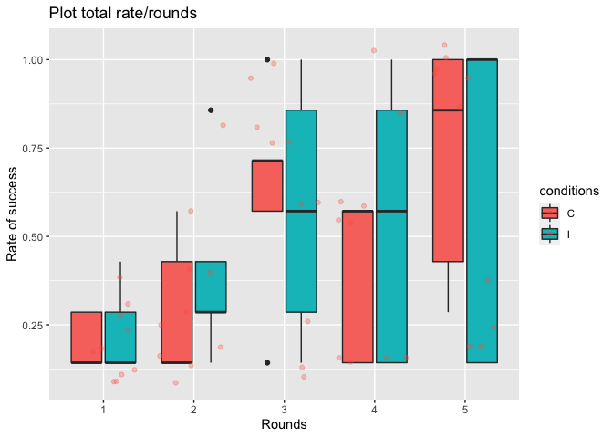

Data Modeling
================
Antoinette Gambaro
(20 June, 2022)

-   [THE MIND; collaboration game](#the-mind-collaboration-game)
    -   [Abstract](#abstract)
    -   [Method](#method)
    -   [Data set](#data-set)
    -   [Description of the
        measurements](#description-of-the-measurements)
    -   [Description of the variables](#description-of-the-variables)
    -   [HYPOTHESIS 1](#hypothesis-1)
        -   [Plot](#plot)
        -   [Statistical analysis](#statistical-analysis)
    -   [HYPOTHESIS 2](#hypothesis-2)
        -   [Plot](#plot-1)
        -   [Statistical analysis](#statistical-analysis-1)
    -   [General conclusion](#general-conclusion)

# THE MIND; collaboration game


## Abstract

Can community groups succeed in non-verbal coordination tasks better
than isolated (non-community) groups?

For this practical i will use data that i collected for a project group

The aim of this study is to test whether community groups succeed better
in non-verbal coordination tasks than isolated groups. To
date,literature suggests that interaction sets precedent for conventions
in a group. Thus, we predicted that for this type of coordination game
The Mind, more repeated interactions between people will lead to a
better performance, because of shared conventions. In other words, the
community condition should perform better. However, our predictions were
not supported in the results, as there were no significant difference
among conditions.

## Method

**Instruction of the game:** Subjects are going to play a card game (The
Mind) in groups of 3. This game is played in up to 12 rounds, of
increasing difficulty. The aim is to put cards from 1-100 in increasing
order (each participant having from 1 to 12 cards according to the
round) without communicating during this process. Every time the
increasing order is not respected, the players lose a life. For our
purpose, when the order is not respected At the beginning of a round (or
whenever a player summons it) all the players reach their hands in the
middle of the table to “connect”. For our purposes, the subjects will be
separated in 2 conditions and play 5-7 rounds.

-   **Community condition**: a group of three that don’t have prior
    relationships play the 5-7 rounds together.
-   **Isolated group condition**: three participants that don’t have
    prior relationships will play a round together. before moving to the
    next round 2 players (also strangers) are changed. This manipulation
    is done until we arrive at 5-7 rounds, making sure that we never
    have in the group subjects that have already played together.

**Sample**: Between-subjects design

***N***= 30

**Structure**

-   Group of 3 subjects
-   Conditions:
    -   Community groups: 3 subjects play 5 rounds together (N= 15)
    -   Isolated groups: 15 subjects play 5 rounds with different
        partners in each round (N=15)

## Data set

``` r
library(tidyverse)
library(knitr)
library(dplyr)
library(ggplot2)
library(readxl)
DATA <- read_excel("~/Desktop/DATA SCIENCE/DATA.xlsx")
View(DATA)
kable(head(DATA))
```

| GAME | ROUND | CONDITION | ID1 | ID2 | ID3 |  T1 |  D1 |  C1 | G1     |  T2 |  D2 |  C2 | G2     |  T3 |  D3 |  C3 | G3     |  T4 |  D4 |  C4 | G4  |  T5 |  D5 |  C5 | G5  |  T6 |  D6 |  C6 | G6  |  T7 |  TT |  DT |      RATE | STATION    |
|-----:|------:|:----------|:----|:----|:----|----:|----:|----:|:-------|----:|----:|----:|:-------|----:|----:|----:|:-------|----:|----:|----:|:----|----:|----:|----:|:----|----:|----:|----:|:----|----:|----:|----:|----------:|:-----------|
|    1 |     1 | I         | M   | N   | O   |   1 | 123 |   0 | 0.0817 |   1 |  13 |   0 | 0.3097 |  NA |  NA |  NA | NA     |  NA |  NA |  NA | NA  |  NA |  NA |  NA | NA  |  NA |  NA |  NA | NA  |  NA |   2 | 136 | 0.2857143 | FLORIANA   |
|    2 |     1 | I         | C   | J   | K   |   1 | 289 |   1 | 0.2616 |  NA |  NA |  NA | NA     |  NA |  NA |  NA | NA     |  NA |  NA |  NA | NA  |  NA |  NA |  NA | NA  |  NA |  NA |  NA | NA  |  NA |   1 | 289 | 0.1428571 | RAPHAEL    |
|    3 |     1 | I         | D   | E   | F   |   1 |  16 |   1 | 0.1851 |   1 |  42 |   1 | 0.1234 |   1 |  66 |   2 | 0.4463 |  NA |  NA |  NA | NA  |  NA |  NA |  NA | NA  |  NA |  NA |  NA | NA  |  NA |   3 | 124 | 0.4285714 | LORENE     |
|    4 |     1 | I         | A   | B   | C   |   1 |  29 |   0 | 0.2723 |  NA |  NA |  NA | NA     |  NA |  NA |  NA | NA     |  NA |  NA |  NA | NA  |  NA |  NA |  NA | NA  |  NA |  NA |  NA | NA  |  NA |   1 |  29 | 0.1428571 | INES       |
|    5 |     1 | I         | H   | I   | G   |   1 |  21 |   0 | 0.0373 |  NA |  NA |  NA | NA     |  NA |  NA |  NA | NA     |  NA |  NA |  NA | NA  |  NA |  NA |  NA | NA  |  NA |  NA |  NA | NA  |  NA |   1 |  21 | 0.1428571 | ANTOINETTE |
|    6 |     2 | I         | F   | N   | K   |   1 | 146 |   0 | 0.1430 |   1 | 223 |   0 | 0.2068 |  NA |  NA |  NA | NA     |  NA |  NA |  NA | NA  |  NA |  NA |  NA | NA  |  NA |  NA |  NA | NA  |  NA |   2 | 369 | 0.2857143 | FLORIANA   |

## Description of the measurements

This is how we collected the data

-   **TIME TO SUCCESS PER ROUND:** the overall time it takes the group
    to move to the next round
-   **PVERALL TIME TO SUCCESS:** the overall time it takes the group to
    succeed the task
-   **SUCCESS RATE PER ROUND:** how many tries it took to succeed a
    round (nb of success/nb of trials)
-   **OVERALL SUCCESS RATE:** how many tries it took to succeed the task
    (nb of success/nb of trials overall)
-   **NUMBER OF CONNECT:** the number of times participant “connect”
    (except the 1st mandatory) during the round
-   **OVERALL NUMBER OF CONNECT:** overall number of connect the number
    of times participant “connect” overall across the game

## Description of the variables

-   **ID (1/2/3)**: identity of the person that is playing
-   **T (1/2/3/4/5/6)**: trial (coded as 1 or 0 which means if they did
    trial or not)
-   **C (1/2/3/4/5/6)**: number of connects
-   **D (1/2/3/4/5/6)**: duration of the trial
-   **G (1/2/3/4/5/6)**: gini coefficient; how much the trial was
    difficult
-   **TT**: total trial in a round
-   **DT**: total duration of the round
-   **RATE**: measure success rate of the round (number of trial divided
    by 7)

## HYPOTHESIS 1

*Community groups take overall less time to succeed the task than
isolated groups*

We expect that community groups take overall less time to succeed the
task than isolated groups, less time means that unsuccessful.

### Plot

So let’s visualize the total duration in each round of the two
condition.

``` r
community <- subset(DATA, CONDITION == "C")
isolated <- subset(DATA, CONDITION=="I")
conditions<-as.factor(DATA$CONDITION) 
roundfac<-as.factor(DATA$ROUND) 
  
  
ggplot(data = DATA, mapping = aes(x = roundfac, y = DT, fill= conditions  
    ))   + 
  geom_boxplot() + 
  geom_jitter(alpha = 0.3, color = "tomato") + 
  labs(title="Plot Total Duration/Rounds", 
          x ="Rounds", y = "Total Duration") 
```

<!-- -->

From the blox plot we can see that the *community groups* (C) take
overall less time to succeed the task than *isolated groups* (I). On the
y-axis we have the total duration of each round (which is the sum of
time spent in the trials). On the x-axis we have the corresponding
round. Visually, it seems that community group (in red) took less time
to succeed a round compared to the isolated group (in blue).

### Statistical analysis

To be sure that there is significant differences betweent the groups,
first I checked the distribution, to see if i can use the t-test, since
this is not the case i will use a non-parametric test.

``` r
shapiro.test(community$DT) #not normally distributed
```

    ## 
    ##  Shapiro-Wilk normality test
    ## 
    ## data:  community$DT
    ## W = 0.88156, p-value = 0.007444

``` r
shapiro.test(isolated$DT)#normally distributed (p-value 0.001)
```

    ## 
    ##  Shapiro-Wilk normality test
    ## 
    ## data:  isolated$DT
    ## W = 0.84316, p-value = 0.00131

``` r
resDT <-wilcox.test(DT ~ CONDITION, DATA,
                    exact = FALSE,
                    conf.int = TRUE)
resDT$p.value #0.1902361 there is no significant difference 
```

    ## [1] 0.1902361

#### Conclusion

However, in this case, the test indicates no significant difference
between conditions since the p-value is 0.19. Our possible explanation
is that probably is due to the fact that size of the sample is not
enought big to detect any significant differences.

## HYPOTHESIS 2

*Community groups have a better overall success rate than isolated
groups*

The community groups have a better overall success rate than isolated
groups, the rate is obtained by dividing the number of trials succeed in
a round by 7 (so the lower it is, the better) and on X axis the
corresponding rounds.

### Plot

Let’s visualize the total rate of success in each round of the two
condition.

``` r
ggplot(data = DATA, mapping = aes(x = roundfac, y = RATE, fill= conditions 
))   +
  geom_boxplot() +
  geom_jitter(alpha = 0.3, color = "tomato") +
  labs(title="Plot total rate/rounds",
       x ="Rounds", y = "Rate of success")
```

<!-- -->

From the box plot you can see on y-axis the rate which is obtained by
dividing the number of trials succeed in a round by 7 (so the lower it
is, the better) and on X axis the corresponding rounds Visually we can
see that overall (across the rounds), the rate of *community groups* (C)
(in red) is lower compared to the *isolated groups* (I) (in blue).

### Statistical analysis

To be sure that there is significant differences between groups, first I
checked the distribution, to see if i can use the t-test, since this is
not the case i will use a non-parametric test.

``` r
shapiro.test(community$RATE)
```

    ## 
    ##  Shapiro-Wilk normality test
    ## 
    ## data:  community$RATE
    ## W = 0.8546, p-value = 0.002156

``` r
shapiro.test(isolated$RATE)
```

    ## 
    ##  Shapiro-Wilk normality test
    ## 
    ## data:  isolated$RATE
    ## W = 0.79966, p-value = 0.0002244

``` r
res <-wilcox.test(RATE ~ CONDITION, DATA,
                   exact = FALSE,
                   conf.int = TRUE)
res$p.value
```

    ## [1] 0.8338305

#### Conclusion

However, in this case, the test indicates no significant difference
between conditions since the p-value is 0.19.

## General conclusion

From the statistical results, the p-value indicate that we could not
efficiently reject the Null Hypothesis 😦😦. The game the Mind relies on
temporal cognition since people have to connect their perception of
time. Probably, community groups didn’t have enough time to develop
conventions or common strategies which could have differentiated them
from the isolated groups which had to readapt to their partners each
round. In future, we should run a power analysis, control and assign
people to the conditions randomly, assure that the recordings are of
quality have a larger sample and make control for other factors
(setting, relationships, number of rounds, etc.)
